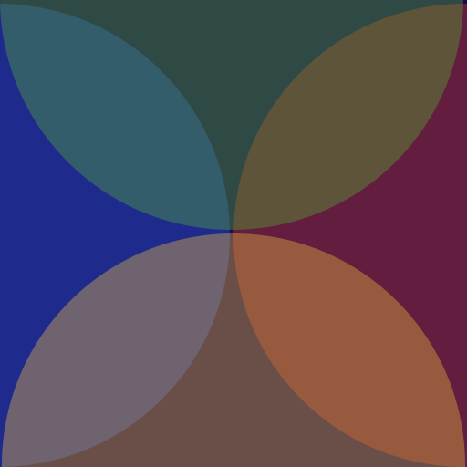

## The Concept of Project Eqlectika: Semantic Field Core & Building an Outside-in Planets Network

Imagine for a moment that anything is possible. Imagine, for example, that the laws of physics were suddenly replaced by the laws of imagination. And this is a very interesting meditation, because it begins like this: "Well, if I could have anything I wanted, what would I want, or what would I prefer to have?" For example, I would somehow move the Vatican Library to Versailles and live in Versailles, have access to every book and work of art that ever existed, and stroll in the garden.

And then I start thinking about it and clarify: "No, but the question was: 'What would it be like if it could be anything?'" So why do you need Versailles, why do you need the Vatican Library, if you can have anything? And you realize that our imagination is completely limited.

Who would we become if we could become anything? I mean, what if I could snap my fingers and you became omnipotent, what would you do?

The first thing I'd do is fly. I'd just leap a kilometer into the sky and give a cowboy whoop... But then we might realize that the universe is entirely at your disposal, that you can cross the galaxy in the blink of an eye. You could travel back to the moment of the Big Bang in the time it takes to think about it.

There's not a single civilization in the history of creation, not a single work of art, not a single delight or experience that's denied you.

And I maintain that within minutes of this transformation, we would become unrecognizable to ourselves, since we're usually completely defined by our limitations.

And that's how I imagine death to be. Death is a peace, so profoundly subconscious that it becomes a revelation that you can be, do, see, think, and feel anything.

### Semantic Core

In the context of singularity, beyond the dualism of matter and consciousness, a third force emerges—Information. 

This is not simply a collection of data, but a stable, decentralized environment with its own gravity. 

In this system, information is viewed not as dry concepts, but as an arrangement of the statics of space and the dynamics of free geometric forms, possessing the phenomenal right of spontaneity.

This is the visual, symbolic core of the internet, operating on the principle of an immutable chain without a central server. 

The basis of the universal node (decentralized terminal) is the Cube. 

Any user can expand it from within, thus creating their own unique 3D symbol. 

Each such arrangement is stored as hash blocks, ensuring user independence.

The process of creation is like the growth of a crystal in a void: 

Clicking on the edge of the cube erases and advances the space by one cube.

All facets are initially transparent, but can change their density from 0.0 to 1.0 with a long press.

This is an environment of real online presence. 

The subject manifests in the field only upon connection, broadcasting their form via peer-to-peer protocols.

Each user's point of origin is fixed and encrypted via an IP address, ensuring a stable "geography"—when you turn on, you always find yourself in a familiar location relative to others.

Different forms can intersect. Other facets are not a barrier—the subject is limited only by their own form, but can freely travel through other architectures at their overlapping points.

This system has no route history to conserve memory; there is only the currently broadcast illusion. 

The form can change offline and directly during the broadcast. 

This is a living process, where users themselves shape their illusion, recording its recognizability in the decentralized ether.

Concentration occurs automatically as needed.

### Outside-in Planet

Imagine a world where the landscape doesn’t sink below the horizon but rises above you, closing into a massive dome overhead: standing in London, you could look straight up and see Australia, other continents, oceans, and cities. Everything on the planet is visible through a telescope because you are inside a sphere, and gravity points outward.

Since existing visual tools couldn’t capture this specific concave geometry properly, the project was built from scratch using JavaScript.

### Current Features

The project is currently a live web-based physics and environment simulation:

Inverted Sphere Physics: A fully functional concave world with gravity directed from the center outward. The thrust direction is completely independent.

Cross-Platform Controls: Implemented for both desktop and mobile (touchscreen split into thrust and steering zones).

VR Support: A dedicated version for Oculus VR headsets is available via the butterfly logo menu at the bottom of the screen.

The current focus is on developing the landscape mechanics and terrain generation.

### Live Demo

You can test the mechanics and explore the inverted world directly in your browser:

[Life](https://eqlectika.github.io/life.html)

**Desktop Controls:**
* Arrow keys – Movement.
* Single / Double tap Space – Thrust control.

**Mobile Controls:**
* Left half of the screen – Thrust.
* Right half of the screen – Steering.

# Selected Projects Overview

## 1. Fast Reading Converter — RSVP Speed Reading Service
* **Tech Stack & Concept:** Client-side PWA (Progressive Web App) designed for speed reading using Rapid Serial Visual Presentation (RSVP).
* **Key Features:**
  * **Smart Dynamic Text Parsing:** An automated engine that adapts frame delay (word display timing) based on punctuation marks (additional pauses for commas, periods, dashes) and word length.
  * **Dynamic Acceleration:** A custom algorithm that smoothly increases and adjusts reading speed following the golden ratio ($\phi \approx 0.618$) toward the end of the text.
  * **Adaptive Interface:** Automatic font size adjustment tailored to the device's physical screen width, CSS animation synchronization (Z-axis, blur, fade) aligned with JS timers, and integration of the *Screen Wake Lock API* to keep the display active.
  * **File Import & Themes:** Support for loading local `.txt` files, instant custom click-to-invert color themes, and complete offline availability.
 
**Read & Use:** [Source Code Gist](https://gist.github.com/eugenebox/9222c544d6dbbc38e9d99c381c1955c4) • [Fast Reading Converter (Flash)](https://eqlectika.github.io/flash.html)

---

## 2. Capital&Eqlectika — Trade Phenomena (Cryptocurrency Analytical Terminal)
* **Tech Stack & Concept:** High-performance crypto-trading dashboard processing binary and futures real-time market data utilizing Chart.js, Web Workers, WebSockets, and the Binance API.
* **Key Features:**
  * **Multithreaded Data Processing (Web Workers):** Offloading heavy mathematical calculations, oscillator computations (RSI-14, 34-period Bollinger Bands), and custom *34/38 Parrots* indicators to background threads.
  * **Multi-Timeframe Integration:** Simultaneous connection to real-time streams across 8 timeframes (`1m` to `1M`) for multiple trading pairs to calculate overall market momentum (*Pair Global Time Force* and *Market Global Force*).
  * **Divergence & Funding Rate Tracking:** Automatic detection and visual mapping of price, RSI, and volume divergences, accompanied by a module tracking real-time and historical futures funding rates.
  * **Custom UI & Cross-Chart Synchronization:** Unified zoom/scroll synchronization across price, pair percentage comparison, and funding rate charts, featuring interactive crosshairs and an adaptive live signal log.
 
**Read & Use:** [Source Code Gist](https://gist.github.com/eugenebox/047f6368d407887e41bdaee6305a27bd) • [Capital&Eqlectika (Market Terminal)](https://eqlectika.github.io/market.html)

---

## 3. Cross Editor — Four-Zone Layout Text & Media Editor
* **Tech Stack & Concept:** Interactive PWA featuring a 4-section (2x2) flexible grid layout designed for concurrent text and image editing.
* **Key Features:**
  * **Interactive Crosshair Controller:** Smooth drag-and-drop central controller allowing dynamic, proportional resizing of all four editing quadrants simultaneously.
  * **Dynamic Style Generation:** Support for custom color schemes, dynamic font switching, and customizable visual themes.
  * **Rich Text & Media Blocks:** Instant insertion, preview, and formatting of text and media within each interactive `contenteditable` container.
  * **Mobile Optimization:** Full touch-event support (`touch-action: none/auto`), responsive layouts, and PWA manifest integration for seamless mobile installation.
 
**Read & Use:** [Source Code Gist](https://gist.github.com/eugenebox/ed5511dc4bbf870f0fa4b1b3fb18bb93) • [Cross Editor](https://eqlectika.github.io/cross.html)
 
### 4. Meme Battle | Breakthrough Engine
* **Tech Stack & Concept:** P2P decentralized meme ranking and evaluation platform built on a direct device-to-device network architecture via lightweight brokers, bypassing central servers entirely.
* **Core Philosophy & Concept:**
  * **Privacy First by Default:** No central server stores user data. The system operates as both a personal catalog and a public leader-board. Content remains completely private until connected peers are online.
  * **Peer-Driven Network Activation:** Operating on a fully decentralized structure supported by real-time online participants, the local resonance matrix activates when sharing direct access links with peers.
* **Key Features:**
  * **Pairwise Elo Battle Engine:** Head-to-head meme comparisons powered by the Elo rating system to evaluate content resonance, promote top-tier posts, and convert accumulated *Impact* into app features.
  * **Direct Vector Transfer & Safety:** Zero mandatory registrations, passwords, or personal data tracking. Users retain full control over their visual vectors and transmit impulses directly to connected participants.
  * **Zero Friction UX:** Instant setup allowing users to drop visual vectors, share direct links with targeted peers, and test content impact across the network.

**Read & Use:** [Meme Battle — Breakthrough Engine](https://eqlectika.github.io/breakthrough.html)

### Joining the Development

The ultimate goal of Eqlectika goes beyond a single inverted planet. The vision is to build an ecosystem where different planets can exist, each running on its own custom logic and scenarios via GitHub.

How you can support the project:
1 Development (GitHub): Looking for JS developers and WebGL/Three.js enthusiasts to help with optimization, procedural landscape generation, and scripting new planetary physics.
2 Spreading the Word: This is a non-commercial open-source project. Any feedback, shares, or GitHub stars are greatly appreciated and help bring more developers into the loop.

If you are fascinated by non-standard astrophysics and creative coding, feel free to dive in!
To achieve smooth, independent movement inside a concave sphere without running into the infamous Gimbal Lock, we had to abandon standard Euler angles for player rotation. Instead, we use quaternions to calculate rotation deltas relative to the object’s current orientation.

## Licensing

This project is dual-licensed:

1. **Open Source (GNU AGPLv3):** Free to use, modify, and distribute for open-source projects. If you host or integrate this engine/code into a networked service or web app, you must publish your source code under the AGPLv3 license.
2. **Commercial License:** If you wish to use this code (including the P2P meme ranking / Elo engine mechanics) in a proprietary product, closed-source SaaS, or commercial platform without disclosing your code, a commercial license is required.

For commercial licensing, custom integration, or contact:
* Email: `yevgeniykorobka@gmail.com`
* Telegram: `@eugenebox`
